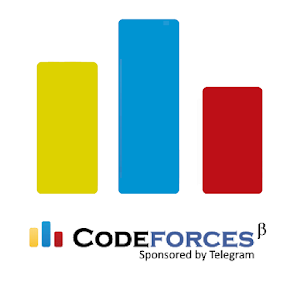

<h1 align="center">Hello There! 👋, I am Nevil Dalsania</h1>
<h4 align="center">
  <code>
    <a href="https://www.linkedin.com/in/nevil-dalsania-66975b214/" title="LinkedIn Profile"> LinkedIn</a></code>
  <code><a href="https://codeforces.com/profile/NEVIL_268" title="Codeforces Profile"> Codeforces</a></code>
  <code><a href="https://stackoverflow.com/users/19859294/nevil-dalsania" title="Stack Overflow Profile"> Stack Overflow</a></code>
  <code><a href="https://www.instagram.com/_nevil_dalsania_/" title="Instagram Profile"> Instagram</a></code>
</h4>
<h3>
   
  🎓 I am a final year student at DAIICT, Gandhinagar.
   
  📈 Technology Analyst Intern '22 @MorganStanley.
   
  💖 I love working with Javascript frameworks.
   
  💻 I have worked on various tech stacks and technologies like MERN Stack, Angular, Django, Flask.
   
  📫 How to reach me: <a href="mailto: nevildalsaniya@gmail.com">nevildalsaniya@gmail.com</a>
</h3>

<h2 align="center">🔥 Languages & Frameworks & Tools & Abilities 🔥</h2>
 

                                    	   

<h2 align="center">⚡ Stats ⚡</h2>
 

    

 
 

    

 
 

    

   
   
  

